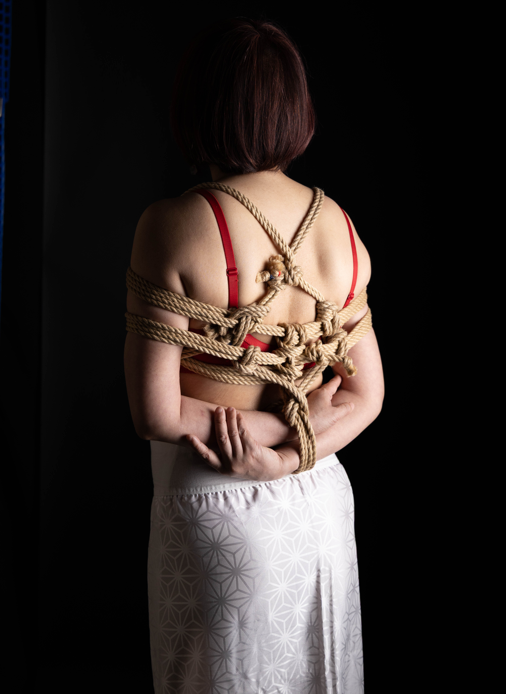
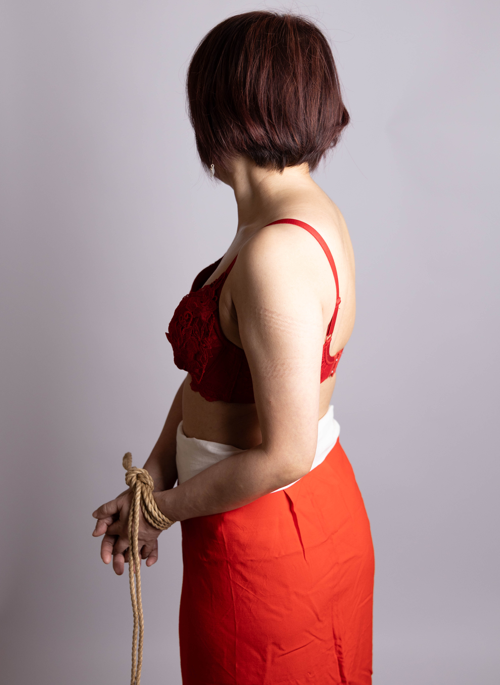
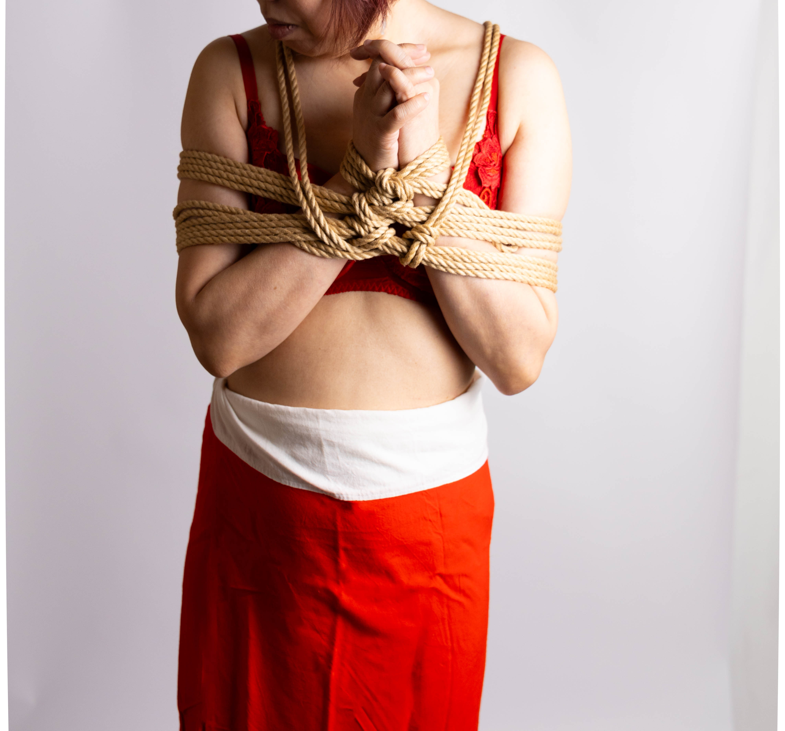
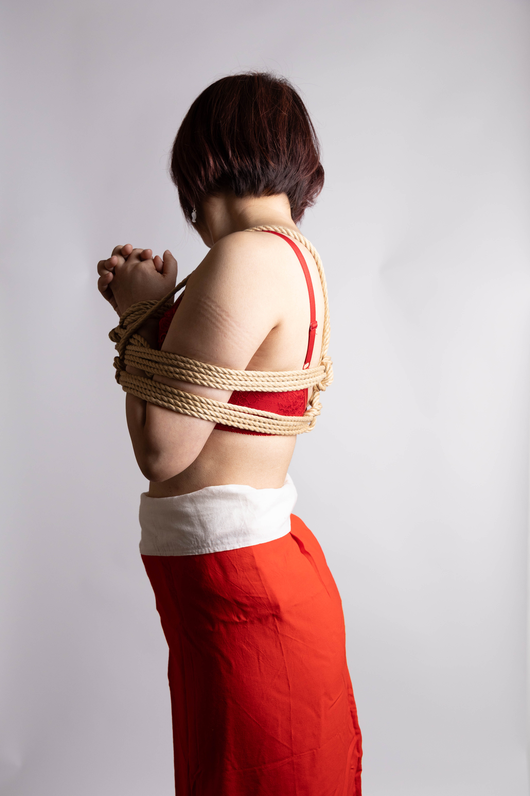
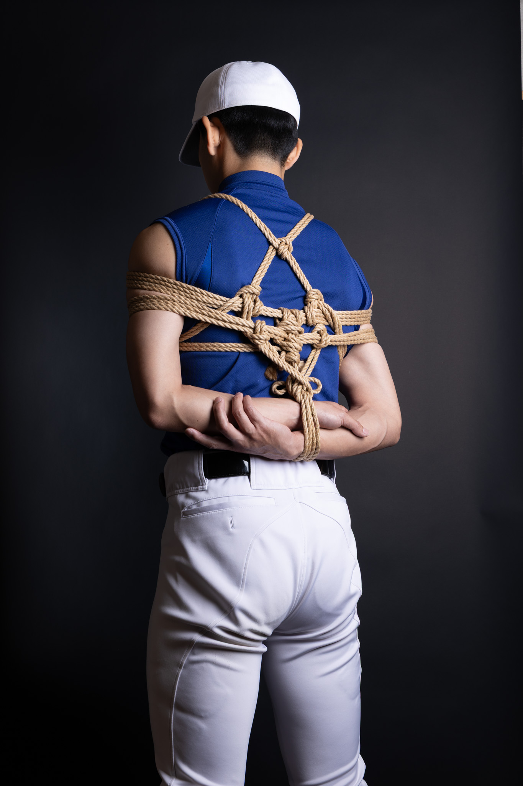
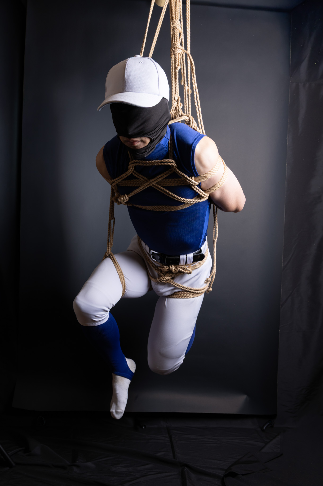
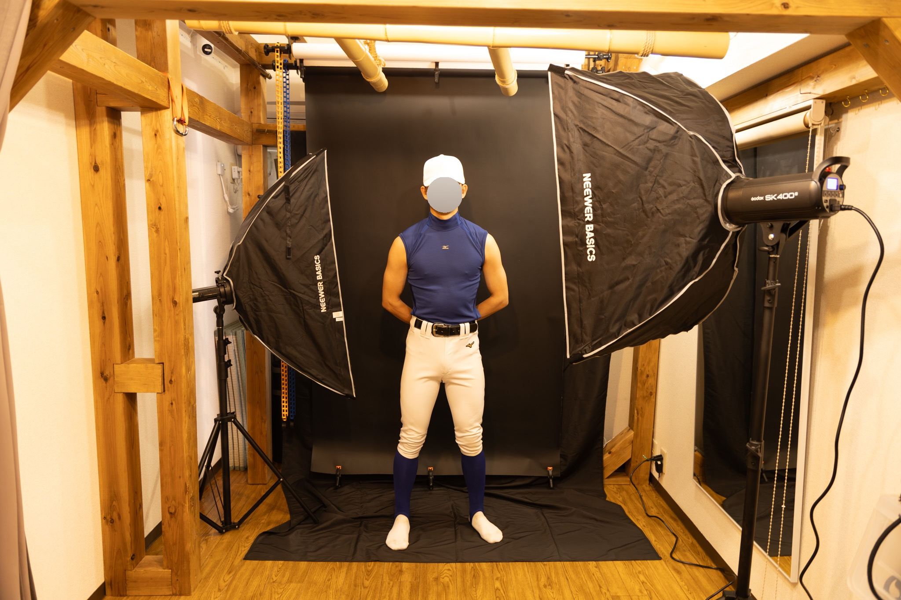

# トップ画像とギャラリーを更新

## 内容
トップページのフィーチャー画像とギャラリーセクションの以下の変更を実施します。

## 詳細

### 1. トップフィーチャー画像の差し替え
- **現在の画像**: `224a3254.jpeg`
- **新しい画像**: 提供画像（縄による緊縛表現のポートレート）
- **対象ファイル**: `index.html` (1321行付近)
- **変更内容**: 
  ```html
  <!-- 現在 -->
  
  
  <!-- 変更後 -->
  
  ```

### 2. ギャラリー画像の追加・再構成
- **現在のギャラリー**: 4枚のポートレート
- **新しいギャラリー**: 8枚（新規4枚を上部に配置）
- **対象ファイル**: `index.html` (1503-1512行付近)
- **変更内容**: 
  ```html
  <div class="gallery-grid">
    <!-- 新規追加4枚（上部） -->
    <div class="gallery-item"></div>
    <div class="gallery-item"></div>
    <div class="gallery-item"></div>
    <div class="gallery-item"></div>
    
    <!-- 既存4枚（下部） -->
    <div class="gallery-item"></div>
    <div class="gallery-item"></div>
    <div class="gallery-item"></div>
    <div class="gallery-item"></div>
  </div>
  ```

### 3. en.html への同期
- 英語版ページ（en.html）にも同様の変更を実施

## CSSの確認
- ギャラリーグリッドは既に4列対応なため、CSS修正は不要
- 8枚の画像が2行×4列で自動配置される

## 完了条件
- [ ] トップ画像がスパイダーマン画像に差し替えられた
- [ ] ギャラリーに新規4枚の画像が上部に追加された
- [ ] 既存4枚の画像が下部に移行した
- [ ] 日本語版（index.html）が更新された
- [ ] 英語版（en.html）が更新された
- [ ] ブラウザで確認して表示が正常であることをテスト

---

## 後追いイシュー

### Issue A: STRATEGY.md の作成と集客戦略の実装

**作成日**: 2026-03-28  
**関連Issue**: #16「LPが緊縛寄りすぎて新規流入を取りこぼしている問題」

**内容**:
市場分析に基づいた集客戦略ドキュメントが作成されました。緊縛需要の構造的天井を分析し、上前津の立地を活かしたコスプレ市場へのシフトを提案しています。

**詳細**:
- 緊縛撮影の需要上限は月5〜7件と推定（PR強化は効果限定的）
- 大須商店街の人流：平日3万人/日、土日7万人/日
- 世界コスプレサミット（毎年8月）：25万人超、大須がメイン会場
- 国内登録コスプレイヤー：34万人、名古屋は世界最大級の集積都市
- コスプレイヤー70.2%が「撮影場所がない」と不満（2019年調査）
- 当スタジオの時間単価（¥3,250/時間）は市場平均（¥1,313/時間）の2.5倍

**実装予定**:
- [ ] STRATEGY.md の内容を基に顧客セグメント戦略の検討
- [ ] LPの訴求内容をコスプレ向けにシフトするか判断
- [ ] 価格プレミアムを正当化する差別化要素の明確化

**ファイル**: `STRATEGY.md`

---

### Issue B: ataru/ ディレクトリ（新規ブランド・プロジェクト）の追加

**追加日**: 2026-04-04

**内容**:
新規ブランド「ataru」のディレクトリとWebサイトが作成されました。独立した3つのHTMLページと18枚の関連画像が含まれています。

**構成**:
```
ataru/
├── index.html        - 入り口/ランディングページ
├── main.html         - メインコンテンツページ（1002行）
├── profile.html      - プロフィール/紹介ページ
└── images/           - 18枚の製品/サービス画像
    ├── 224A2715.jpeg
    ├── 224A2815.jpeg
    ├── 224A3035.jpeg
    ├── 224A3124.jpeg
    ├── 224A3127.jpeg
    ├── 224A3130.jpeg
    ├── 224A3133.jpeg
    ├── DSC03598.jpeg
    ├── DSC03600.jpeg
    ├── IMG_3149.jpeg
    ├── IMG_3771.jpeg
    ├── IMG_5723.jpeg
    ├── IMG_7264.jpeg
    ├── IMG_7268.jpeg
    ├── IMG_7269.jpeg
    ├── IMG_7276.jpeg
    ├── IMG_7278.jpeg
    └── IMG_7741.jpeg
```

**確認項目**:
- [ ] `ataru/` ディレクトリの目的と立ち位置の明確化（Studio Nagoya Baseのビジネスラインか、別ブランドか）
- [ ] `ataru/main.html` の内容とデザイン方針の確認
- [ ] SEO設定（meta tags, 検索可能性）の確認
- [ ] メインサイトとの関係性の整理（リンク構造、ナビゲーション）
- [ ] 公開/非公開ステータスの決定

**備考**: 新規リポジトリ `https://github.com/nagoya-base/ataru-nagoya.git` へもsubtree pushされているため、独立したプロジェクトの可能性あり。

---

**更新日**: 2026-04-04  
記録者: 後追いイシュー化
