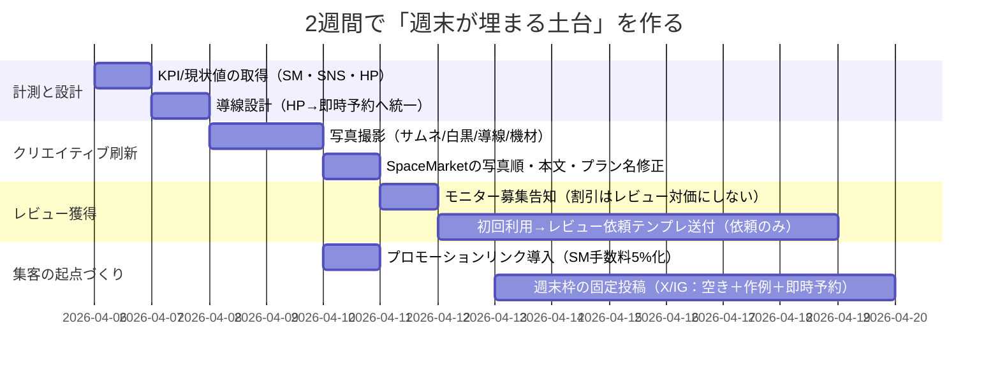

# 名古屋・上前津「スタジオ名古屋ベース」週末予約が埋まらない要因分析レポート

## エグゼクティブサマリー

本件は「需要（立地）不足」というより、**SpaceMarket内での“見つかりにくさ×信頼不足（レビュー0）×サムネ/訴求の路線ズレ”による機会損失**が主因の可能性が高いです。現状のSpaceMarket掲載は**レビュー0件**で、駅徒歩8分・24㎡・〜4名・¥2,600〜¥3,250/時という仕様が示されています。citeturn1view0 週末に強い競合は、同じ上前津徒歩5〜6分圏に**高評価＆レビュー多数**で存在し、検索結果・比較段階で不利になりやすい状況です。citeturn11view0turn12view0turn13view0turn6view0

一方、上前津〜大須周辺は、**大須観音の定例市（毎月18日・28日）**や、**世界コスプレサミット（会場に大須商店街が含まれる）**など、撮影・コスプレ文脈の人流が発生しやすいエリアです。citeturn9search0turn9search2turn9search6turn9search24 したがって、場所そのものより「比較される場（SpaceMarket）で勝てる見せ方」に寄せるほど、週末は改善余地があります。

結論として、寄与度（推定）は **SpaceMarket掲載（写真・タイトル・レビュー）≈70% / 自社導線（予約の摩擦）≈20% / 立地≈10%**。この推定は、現状データ（閲覧数・保存数・CVR）が未共有のため、後述の方法で検証・補正すべきです。

即効性が高い対策は次の4点です。  
- **サムネ（1枚目）を「明るい通常撮影の完成形」に差し替え**、クリック率を上げる（路線ズレ解消）  
- **レビュー0→まず5件獲得**（レビュー依頼は可、インセンティブ付与は禁止）citeturn15search3  
- **SpaceMarketのプロモーションリンク**で、自己集客予約の手数料を**30%→5%**に寄せ、利益と集客投資余力を作るciteturn10search10turn10search1turn10search9  
- HPの予約導線を「DM/メール中心」から、**“即時に予約できる1本線”**へ寄せる（少なくとも週末枠は即時化）

---

## 現状整理

### ポジショニングと提供価値

- 公式サイト上の訴求は「完全個室」「コスプレ・ポートレート・作品撮り」「フルカラー天井照明」「大型ミラー」に加え、**木組みの吊り床・竹吊り対応**など、身体表現（緊縛）文脈にも強い設計です。citeturn4view0turn4view2  
- 料金は、土日祝2時間6,500円／3時間9,750円（=延長換算3,250円/時）など、SpaceMarket掲載の休日¥3,250/時と整合しています。citeturn4view2turn1view0  
- 公式サイトの予約は「空き確認（カレンダー）→メール or X（旧Twitter）で連絡」の運用です。citeturn4view2 この方式は**“今この場で確定したい”週末需要**と相性が悪く、離脱が起きやすいです（推定・後述の計測で検証）。

### SpaceMarket掲載の要点（現状）

- タイトル： 「大須・上前津徒歩8分 / フルカラー照明×本格機材 / 完全個室の貸切撮影スタジオ」  
- 価格：平日¥2,600/時、休日¥3,250/時（2時間〜）  
- 仕様：24㎡、定員4名、上前津徒歩8分（東別院徒歩8分表記もあり）  
- 重要：**レビュー0件**citeturn1view0

また、掲載写真の第一印象が「紫系の暗めライティング＋フレーム/ミラー強調」になっている場合、一般的な「白背景・自然光・明るい室内」志向のユーザーには敬遠されやすい一方、身体表現文脈のユーザーには“刺さるが探し当てにくい”状態になりがちです（サムネと文章の路線ズレが起きやすい）。citeturn2view0turn1view0turn4view0

### 立地と需要ドライバー

上前津〜大須は、少なくとも以下の“撮影文脈の人流”が発生します。  
- **大須観音骨董市（毎月18日・28日）**citeturn9search0turn9search20turn9search24  
- **世界コスプレサミット2026（大須商店街を含む栄エリア複数会場）**citeturn9search2turn9search6turn9search10  

よって「場所が悪くて週末が埋まらない」より、「比較される市場（SpaceMarket）での勝ち筋不足」を疑うのが合理的です。

---

## 適合度評価

スコアは **10点満点（10=理想に近い）**。短理由は“週末に予約が入るか”視点で記載します。

| 項目 | スコア | 短理由 |
|---|---:|---|
| サイト | 6 | 情報量と特徴は強いが、予約がDM/メール中心で即時性が弱い。citeturn4view2turn4view0 |
| 写真/ビジュアル | 3 | “通常撮影の完成形”より独自設備・暗め演出が前に出ると、一般層のクリック/不安解消に弱い（路線ズレ）。citeturn2view0turn8view6turn4view0 |
| 価格 | 7 | 撮影スタジオ系競合（¥4,000〜/時以上が多い）より安いが、コスプレ可の“おうちスペース”は¥1,000台も多く比較負けしやすい。citeturn12view0turn13view0turn14view0 |
| 導線/予約フロー | 5 | SpaceMarketは即時予約で強い一方、HP側は即時確定しづらい。導線が分散しCVが落ちやすい。citeturn1view0turn4view2 |
| コンセプト設計 | 4 | 「一般撮影」×「身体表現（緊縛）」の二重コンセプトは強いが、入口（サムネ/本文）が曖昧だと誰にも刺さらない状態になりやすい。citeturn4view0turn1view0 |
| 立地 | 7 | 上前津徒歩8分は許容圏。強い競合は徒歩5〜6分が多く、微不利だが致命傷ではない。citeturn1view0turn11view0turn12view0turn13view0 |
| 設備 | 8 | フルカラー照明・ミラー・背景紙・機材常設に加え吊り床等の独自性がある。価値は高い。citeturn4view0turn1view0 |
| レビュー | 1 | SpaceMarketでレビュー0は週末需要の比較段階で致命的になりやすい。citeturn1view0 |

---

## 主要問題点と改善施策

優先度は「週末の予約を増やす」観点で **Impact（期待効果）×Speed（即効性）** を重視しています。コストは概算レンジです（制作を外注する場合は上振れ）。

### 施策一覧（優先順位つき）

| 優先 | 問題点 | 具体施策 | 実行コスト | 期待効果（目安） |
|---:|---|---|---:|---|
| 最優先 | SpaceMarketレビュー0で信頼不足 | **最初の5レビュー獲得**：①既存の知人/常連に“正規予約”依頼 ②利用後にレビュー依頼（操作・対価は禁止、依頼は可）citeturn15search3 | 値引き原資0〜2万円（※レビュー対価にしない） | CVR 1.3〜2.0倍（新規の心理障壁が下がる） |
| 最優先 | サムネ（1枚目）が一般層に刺さらない/不安が残る | **1枚目を「明るい通常撮影の完成形」に変更**。白背景・ライト設置・距離感・清潔感を1枚で伝える | 自前0〜1万円 / 外注3〜8万円 | CTR上昇→閲覧増（1.2〜1.8倍） |
| 高 | コンセプトが二重で入口が曖昧 | **入口を2系統に分ける**（同一スペース内で可）：①コスプレ/ポトレ向け ②身体表現（吊り床）向け。プラン名・写真順・説明文を切り替える | 0〜1万円 | “刺さる人”が増え、保存・問い合わせ増 |
| 高 | 自社HPの予約摩擦 | HPの主要CTAを「即時予約」へ：**SpaceMarketのプロモーションリンク**（手数料30%→5%）をメイン導線化citeturn10search10turn10search1turn10search9 | 0〜5千円 | 離脱減＋手数料圧縮で利益改善 |
| 中 | 価格が「おうちスペース」と比較される | “安さ”ではなく“失敗しない”で勝つ：**機材無料・再現性・作例**を強調。加えて**平日2hお試し**など入口プランを設計 | 0〜1万円 | 価格比較の土俵をズラす |
| 中 | 禁止事項が長く、初見で怖い | ルールは維持しつつ、見せ方を改善：「OK/NG早見表」＋「近隣配慮の理由」を短く明記（本文末尾に詳細）citeturn1view0 | 0円 | 不安の軽減、離脱低下 |
| 中 | データがなく、どこで落ちているか不明 | **計測設計**：SpaceMarketの表示/閲覧/保存/予約率、HPアクセス・CTAクリック（UTM）を取得 | 0〜1万円 | “効く施策”に集中できる |

### まず集めるべきデータ（未指定＝現状不明）

現時点では「週末が埋まらない」現象の、(A)閲覧不足なのか (B)閲覧→予約の転換不足なのかが確定できません。両者で打ち手が真逆になります。以下を取得してください（所要30〜90分）。  
- SpaceMarket：**表示回数（インプレッション）／ページ閲覧数／お気に入り数／予約数／曜日別予約**  
- HP：**アクセス数／流入元（SNS/検索）／“予約ボタン”クリック数**（UTM付与）  
- SNS：**投稿別インプレッション／プロフィールクリック／リンククリック**  
- 予約ログ（自前でも可）：**予約日時・リードタイム・利用時間・用途**（週末に弱い用途が見える）

---

## 競合・需要環境

### 競合比較表（上前津〜大須周辺・代表例）

稼働想定は公開されているレビュー数・直近レビューの有無からの推定（正確値ではありません）。

| スペース | 立地 | 面積/定員 | 価格帯（目安） | 稼働想定 | 差別化要素 |
|---|---|---|---|---|---|
| **千代田ヴィレッジ** | 上前津徒歩6分 | 31㎡ / 〜10人 | ¥5,412〜¥10,051/時 | 高（レビュー23・評価4.9） | 白ホリ/クロマキー/配信・防音/光回線等、用途が明確citeturn11view0 |
| **photosutdio PIXIE（A）** | 上前津徒歩5分 | 26㎡ / 〜10人 | ¥4,158〜¥5,544/時 | 中〜高（レビュー10・評価4.5） | 内装“世界観”の作り込み（教会風など）＋駅近citeturn12view0turn12view1 |
| **Space et cetera** | 上前津徒歩5分 | 85㎡ / 〜15人 | ¥4,620〜¥8,085/時 | 高（レビュー17・評価5.0） | 多用途＋自然光・広さ・写真枚数42で不安解消が強いciteturn6view0 |
| **スペースボン 上前津 Gemini** | 上前津徒歩5分 | 20㎡ / 〜8人 | ¥785〜¥1,443/時 | 高（レビュー40・評価4.8） | 低価格×推し会/パーティדコスプレ撮影も可”で週末を取りやすいciteturn13view0turn13view1 |
| **あなた（現状）** | 上前津徒歩8分 | 24㎡ / 〜4人 | ¥2,600〜¥3,250/時 | 不明〜低（レビュー0） | 独自設備（カラー照明・ミラー・吊り床）で尖れるが、入口の見せ方が鍵citeturn1view0turn4view0 |

競合が強い理由は単純で、**「レビュー」「写真の量と質」「用途の明確さ」**が揃っており、比較時に不安が消えるからです。あなたのスペースは設備・独自性は強いのに、**“最初の1クリック”と“レビューがない不安”**で落ちている可能性が高いです。citeturn1view0turn6view0turn11view0turn13view0

### 近隣需要ドライバー

- 大須では**定例の市（毎月18日・28日）**があり、週末と重なる月は観光・散策の人流が増えます。citeturn9search0turn9search20turn9search24  
- **世界コスプレサミット**は栄中心に複数会場で、大須商店街も会場に含まれると明記されています。大須〜上前津圏の撮影ニーズは強いはずです。citeturn9search2turn9search6turn9search10  

image_group{"layout":"carousel","aspect_ratio":"16:9","query":["白ホリ 撮影スタジオ 室内 明るい","コスプレ 撮影スタジオ 和室","RGB 照明 撮影スタジオ 内装","名古屋 大須 撮影スポット 風景"],"num_per_query":1}

---

## 収益モデルとKPI・2週間プラン

### 収益予測モデル

#### 前提（公開情報＋保守仮定）

- 料金：平日¥2,600/時、休日¥3,250/時（SpaceMarket掲載）citeturn1view0  
- SpaceMarket手数料：ホスト側は**時間貸し成約金額（税抜）の30%**citeturn10search10  
- プロモーションリンク経由：手数料が**30%→5%**になる旨が公式に案内されていますciteturn10search1turn10search9  
- 固定費（仮）：家賃・管理費8万、光熱1万、通信6千、消耗品5千、保守4千（合計10.5万）※未指定のため仮置き  
- 変動費（仮）：1予約あたり500円（背景紙・清掃用品など）

#### シナリオ別（月次）

| シナリオ | 週末稼働 | 平日稼働 | 月売上 | 手数料控除後 | 固定費+変動費 | 月利益 |
|---|---:|---:|---:|---:|---:|---:|
| 現状（保守推定） | 6h | 6h | ¥35,100 | ¥24,570（30%控除） | ¥107,000 | **−¥82,430** |
| 改善未実施（3ヶ月後） | 6h | 6h | ¥35,100 | ¥24,570 | ¥107,000 | **−¥82,430** |
| 改善実施（3ヶ月後想定） | 32h | 16h | ¥145,600 | ¥132,496（手数料9%想定） | ¥111,000 | **＋¥21,496** |

※「改善実施」は、(a)週末の半分程度が埋まる (b)自己集客をプロモーションリンクに寄せ、手数料率を平均9%程度まで圧縮、という前提の“勝ち筋”モデルです。手数料率の圧縮そのものは公式仕様に基づきます。citeturn10search10turn10search1turn10search9

#### 損益分岐の目安（重要）

週末40%・平日60%の稼働配分を仮定すると、平均単価は約¥2,860/時。  
- 手数料30%のままだと **約53時間/月**で損益分岐（固定費10.5万仮定）  
- 手数料9%まで落とせると **約40時間/月**で損益分岐  

ここが「週末が埋まらない」問題の本質で、**“レビューと入口改善で稼働を上げる”**だけでなく、**“手数料圧縮で必要稼働を下げる”**のが同時に効きます。citeturn10search10turn10search1turn10search9

### ポテンシャル評価とKPI

#### 3ヶ月（短期）

- 成功確率（推定）：**55%**  
  - 条件：レビュー5件獲得＋サムネ改善＋導線一本化（即時予約）  
- KPI（3ヶ月目）：  
  - 週末稼働：**24〜32時間/月**（週末の3〜4割が埋まる）  
  - 月売上：**10〜15万円**（手数料圧縮込みで黒字化が見えるライン）

#### 12ヶ月（中期）

- 成功確率（推定）：**70%**（“運用が継続できた場合”）  
- KPI（12ヶ月目）：  
  - レビュー：**20件**（比較に勝てる最低ライン）  
  - 週末稼働：**40〜50時間/月**  
  - 月売上：**18〜22万円**（固定費次第で利益5〜9万円圏）

### SpaceMarketタイトル案と1枚目コンセプト

**狙い：週末ユーザーの検索語と、1クリック目の不安解消を一致させる。**

- タイトル案（一般撮影寄り）  
  「【上前津8分｜完全個室】白黒背景紙＋ライト使い放題｜スマホでも盛れる撮影スタジオ（〜4名）」  
- タイトル案（身体表現寄り）  
  「【上前津8分｜完全個室】吊り床対応（安全注意）｜身体表現・アート撮影スタジオ｜白黒背景×カラー天井照明」

1枚目（サムネ）のコンセプト：  
- **“明るい白背景の完成形”**を最優先（暗色/特殊色は2〜3枚目へ）  
- 画角：部屋の対角から、背景紙の奥行きとライト位置がわかるワイド  
- 情報：背景紙（白）＋ライト2灯＋床養生＋清潔感（余計な物を消す）

### 写真ショットリスト（掲載順・設定例）

**掲載順は「不安解消 → バリエーション → 使い方」** の順が鉄板です。

1. **サムネ**：白背景＋ライト設置済み（部屋ワイド）  
   - iPhoneならWB固定（例：5000〜5600K）、露出固定（AE/AFロック）  
2. 白背景の“作例”（人物は完全に健全な服装・コスプレ推奨）  
3. 黒背景の作例（同じ構図で“撮れる幅”を見せる）  
4. フルカラー天井照明の作例（紫/赤などはここで出す）  
5. 大型ミラーの使い方（自撮り・構図確認）  
6. 更衣/導線（トイレ兼更衣スペースの見せ方、荷物置き場）citeturn4view0turn4view2  
7. 機材一覧（ライト・背景紙・スタンドを“俯瞰で1枚”）  
8. 入退室（スマートロック等があれば“手順1枚”）  
9. 禁止事項は「OK/NG早見表」を画像化（文章は末尾）

### 2週間アクションプラン

補足：SpaceMarketのレビューは「依頼は可能」ですが、**金銭や特典などインセンティブ付与による操作は禁止**と規約に明記があります。レビュー獲得は“体験を良くして自然に集める”設計に寄せるのが安全です。citeturn15search3turn15search2

---

### 最終所見

- **立地**：上前津徒歩8分は十分戦える。周辺には定例イベント・コスプレ大型イベントもあり、需要はある側。citeturn1view0turn9search0turn9search2turn9search6  
- **主要ボトルネック**：SpaceMarket内での“比較負け”（レビュー0＋入口の見せ方）citeturn1view0turn11view0turn13view0  
- **勝ち筋**：①サムネを一般向け完成形に寄せる ②レビュー5件 ③予約導線を即時に統一 ④プロモーションリンクで手数料を圧縮し、集客投資の余地を作るciteturn10search10turn10search1turn10search9